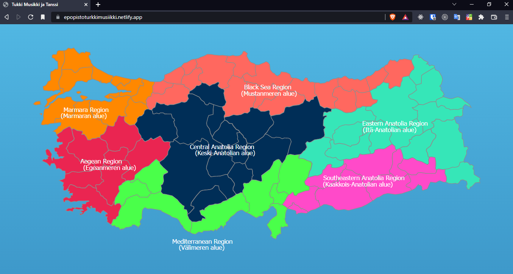

# Turkey's Regions and Music

This site is made for Etälä Pohjanmaan Opisto international day activities.  
In the site, there is a Turkish map and regions information. It is in Finnish Language. This page is done without **`JavaScript`** files.

👉Live on [here](https://epopistoturkkimusiikki.netlify.app/)

_<small>This page is done in 2 days.</small>_

## When I making this page I practiced,

- `SVG` images,
- `HMTL` `meta` tag and `content` attribute,
- Embedding `iframe` videos to page.
